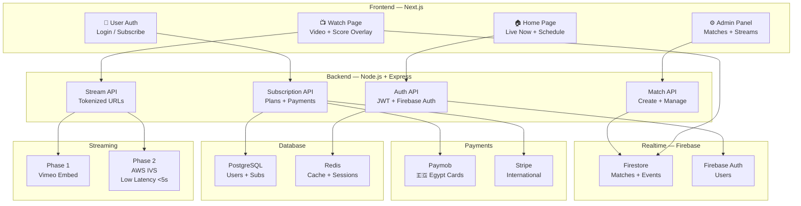

# 🏐 XURA Stream — منصة البث الرياضي المتكاملة

خطة معمارية كاملة لبناء منصة SaaS للبث المباشر لمباريات الكرة الطائرة، مع ربطها بنظام النتائج XURA الحالي.

---

## 🧭 رؤية المشروع

منصة رقمية متكاملة تجمع بين:
- **بث مباشر** لمباريات الكرة الطائرة (مثل Vimeo/YouTube Live)
- **نتائج حية** مرتبطة بحكم المباراة (نظام XURA الحالي)
- **اشتراكات** بخطط مرنة مع بوابة Paymob لمصر
- **تجربة Netflix** في الواجهة والسرعة

---

## 🏗️ Architecture الكاملة



---

## 📦 3 مراحل تطوير واضحة

### ✅ المرحلة الأولى — MVP (4-6 أسابيع)
> **الهدف:** بث + نتائج + مشاهدة مجانية — بدون دفع

| المكون | التقنية | الوقت |
|--------|---------|-------|
| Embed Vimeo في صفحة المباراة | Vimeo Player SDK | 2 أيام |
| Score Overlay فوق الفيديو | Firebase + CSS overlay | 2 أيام |
| صفحة رئيسية (Live Now) | Next.js | 3 أيام |
| تسجيل مستخدمين | Firebase Auth | 1 يوم |
| ربط match_id بـ stream_id | Firestore | 1 يوم |
| Admin: إضافة stream لمباراة | إضافة في admin-db-manager | 2 يوم |

**الناتج:** 🎯 منصة تعمل بالكامل بدون أي تكلفة إضافية

---

### 🔶 المرحلة الثانية — Subscriptions (4-6 أسابيع)
> **الهدف:** نظام الاشتراكات + حماية المحتوى

| المكون | التقنية | الوقت |
|--------|---------|-------|
| خطط الاشتراك (Free/Monthly/Pass) | PostgreSQL + Node.js | 4 أيام |
| Paymob Integration (مصر) | Paymob API | 3 أيام |
| Stripe Integration (دولي) | Stripe SDK | 2 أيام |
| Tokenized Video URLs | JWT + Signed URLs | 2 أيام |
| حماية Vimeo بـ Private + Domain Lock | Vimeo API | 1 يوم |
| User Dashboard (اشتراكاتي) | Next.js | 3 أيام |

---

### 🚀 المرحلة الثالثة — Production Scale (2-3 أشهر)
> **الهدف:** AWS IVS + Low Latency + Mobile

| المكون | التقنية | الوقت |
|--------|---------|-------|
| AWS IVS Migration | AWS SDK + Node.js | 2 أسابيع |
| Low Latency < 5s | IVS Ultra-Low Latency | متضمن |
| DVR / Replay | S3 + IVS Recording | 1 أسبوع |
| Push Notifications | Firebase FCM | 1 أسبوع |
| Mobile PWA | Next.js PWA | 1 أسبوع |
| Multi-bitrate Streaming | IVS Auto Quality | متضمن |

---

## 🗄️ Database Schema

### PostgreSQL Tables

```sql
-- المستخدمون
CREATE TABLE users (
  id          UUID PRIMARY KEY DEFAULT gen_random_uuid(),
  firebase_uid VARCHAR(128) UNIQUE NOT NULL,
  email       VARCHAR(255) UNIQUE NOT NULL,
  name_ar     VARCHAR(100),
  name_en     VARCHAR(100),
  plan        VARCHAR(20) DEFAULT 'free', -- free | monthly | tournament
  plan_expires_at TIMESTAMPTZ,
  created_at  TIMESTAMPTZ DEFAULT NOW()
);

-- خطط الاشتراك
CREATE TABLE subscription_plans (
  id          SERIAL PRIMARY KEY,
  name        VARCHAR(50) NOT NULL,        -- free, monthly, tournament_pass
  price_egp   DECIMAL(10,2),
  price_usd   DECIMAL(10,2),
  duration_days INT,
  max_streams INT DEFAULT -1,              -- -1 = unlimited
  features    JSONB
);

-- المدفوعات
CREATE TABLE payments (
  id          UUID PRIMARY KEY DEFAULT gen_random_uuid(),
  user_id     UUID REFERENCES users(id),
  plan_id     INT REFERENCES subscription_plans(id),
  amount      DECIMAL(10,2) NOT NULL,
  currency    VARCHAR(3) DEFAULT 'EGP',
  gateway     VARCHAR(20),                 -- paymob | stripe
  gateway_txn_id VARCHAR(255),
  status      VARCHAR(20) DEFAULT 'pending', -- pending | paid | failed
  created_at  TIMESTAMPTZ DEFAULT NOW()
);

-- البث المباشر
CREATE TABLE streams (
  id          UUID PRIMARY KEY DEFAULT gen_random_uuid(),
  match_id    VARCHAR(100) NOT NULL,       -- Firestore match ID
  title_ar    VARCHAR(255),
  title_en    VARCHAR(255),
  vimeo_id    VARCHAR(50),                 -- Phase 1
  ivs_channel_arn VARCHAR(255),            -- Phase 2
  ivs_playback_url VARCHAR(500),
  status      VARCHAR(20) DEFAULT 'scheduled', -- scheduled | live | finished
  is_free     BOOLEAN DEFAULT false,
  plan_required VARCHAR(20) DEFAULT 'monthly',
  thumbnail_url VARCHAR(500),
  starts_at   TIMESTAMPTZ,
  ended_at    TIMESTAMPTZ,
  created_at  TIMESTAMPTZ DEFAULT NOW()
);

-- Access Tokens للبث المحمي
CREATE TABLE stream_tokens (
  token       VARCHAR(255) PRIMARY KEY,
  user_id     UUID REFERENCES users(id),
  stream_id   UUID REFERENCES streams(id),
  expires_at  TIMESTAMPTZ NOT NULL,
  ip_address  VARCHAR(45),
  created_at  TIMESTAMPTZ DEFAULT NOW()
);
```

### Firestore Collections (الموجودة + الجديدة)
```
matches/         ← موجود ✅ (يضاف stream_id)
events/          ← موجود ✅
tournaments/     ← موجود ✅
stream_config/   ← جديد: إعدادات البث لكل مباراة
  └── {matchId}
        ├── vimeo_id
        ├── is_live: bool
        ├── overlay_enabled: bool
        └── quality: 'hd' | 'sd'
```

---

## 🔌 Backend APIs

### Auth
```
POST /api/auth/register     → إنشاء مستخدم
POST /api/auth/login        → تسجيل دخول
GET  /api/auth/me           → بيانات المستخدم الحالي
```

### Subscriptions
```
GET  /api/plans             → قائمة خطط الاشتراك
POST /api/subscribe         → بدء اشتراك
POST /api/payments/paymob/callback  → استقبال Paymob callback
POST /api/payments/stripe/webhook   → Stripe webhook
GET  /api/subscription/status       → حالة اشتراك المستخدم
```

### Streams
```
GET  /api/streams           → قائمة البثوث (مع فلاتر)
GET  /api/streams/:id       → تفاصيل بث
POST /api/streams/:id/token → توليد Tokenized URL للمشاهدة
GET  /api/streams/live      → البثوث الحية الآن
POST /api/admin/streams     → إضافة بث (Admin only)
PATCH /api/admin/streams/:id/status → تغيير status
```

### Realtime Score (موجود عبر Firebase)
```
Firebase onSnapshot → matches/{matchId} → overlay تلقائي
```

---

## 📺 Score Overlay Component

```javascript
// components/ScoreOverlay.jsx (يُضاف فوق الـ Video Player)
export function ScoreOverlay({ matchId }) {
  const [match, setMatch] = useState(null)

  useEffect(() => {
    // Firebase listener — نفس منطق XURA الحالي
    const unsub = onSnapshot(doc(db, 'matches', matchId), snap => {
      if (snap.exists()) setMatch(snap.data())
    })
    return unsub
  }, [matchId])

  if (!match) return null

  return (
    <div className="score-overlay">
      {/* Team Names + Score */}
      <div className="overlay-home">{match.home?.name_ar}</div>
      <div className="overlay-score">
        {match.currentHomeScore} – {match.currentAwayScore}
      </div>
      <div className="overlay-away">{match.away?.name_ar}</div>
      {/* Set indicator */}
      <div className="overlay-set">ش {match.currentSetNum}</div>
    </div>
  )
}
```

---

## 💰 خطط الاشتراك المقترحة

| الخطة | السعر | المميزات |
|-------|-------|----------|
| 🆓 **Free** | مجاناً | مباراة واحدة أسبوعياً · جودة 480p |
| 📅 **Monthly** | 49 جنيه / شهر | كل المباريات · 1080p · Replay |
| 🏆 **Tournament Pass** | 99 جنيه | بطولة كاملة · تنزيل الملخصات |

---

## 🔐 حماية المحتوى

```
المستخدم يطلب مشاهدة
    ↓
Backend يتحقق من الاشتراك (PostgreSQL)
    ↓
يولّد Signed Token (JWT, صالح 4 ساعات، مقيّد بالـ IP)
    ↓
Frontend يستخدم Token للوصول لـ Vimeo Private URL
    ↓
Vimeo يتحقق من Domain Referrer
    ↓
البث يبدأ ✅
```

---

## ⚡ ما يمكن بناؤه الآن على XURA

> **لا تحتاج لـ backend جديد في البداية!**

1. **إضافة حقل `vimeo_id`** في Firestore لكل مباراة
2. **صفحة Watch** في Next.js: Vimeo embed + Firebase overlay
3. **Firebase Auth** لتسجيل المستخدمين
4. **Firestore rules** لحماية البث من المستخدمين غير المسجلين

هذا يعطيك **منصة عاملة 100%** في أسبوع واحد!

---

## 📋 الأسئلة المفتوحة للمراجعة

> [!IMPORTANT]
> **ما هي أولوية البدء؟**
> - Option A: ابدأ بـ **Vimeo Embed** داخل XURA الحالي (أسرع — أسبوع واحد)
> - Option B: ابدأ بـ **Next.js Project كامل** من الصفر (أشمل — 3 أسابيع)

> [!IMPORTANT]
> **بوابة الدفع الأولى؟**
> - Paymob فقط في البداية (مصر) — أبسط
> - Stripe + Paymob معاً — أشمل لكن أعقد

> [!WARNING]
> **Vimeo pricing:** خطة Vimeo Premium تبدأ من ~$75/شهر للبث المباشر. هل لديك حساب؟
> AWS IVS أرخص على المدى الطويل لكن أعقد في الإعداد.

> [!NOTE]
> **الـ Domain:** هل ستنشر على Vercel (الحالي) أم على Domain مخصص؟
> مهم لـ Vimeo Domain Lock وPaymob Callback URLs.

---

## 🗓️ خارطة الطريق التنفيذية

```
الأسبوع 1-2:  Vimeo embed + Score Overlay + صفحة Watch
الأسبوع 3-4:  Firebase Auth + User accounts + Admin: إضافة streams
الأسبوع 5-6:  Node.js Backend + PostgreSQL + خطط الاشتراك
الأسبوع 7-8:  Paymob Integration + Token protection
الشهر 3:      AWS IVS + Low Latency + Notifications
الشهر 4-6:    Mobile PWA + Multi-camera + Stats
```
